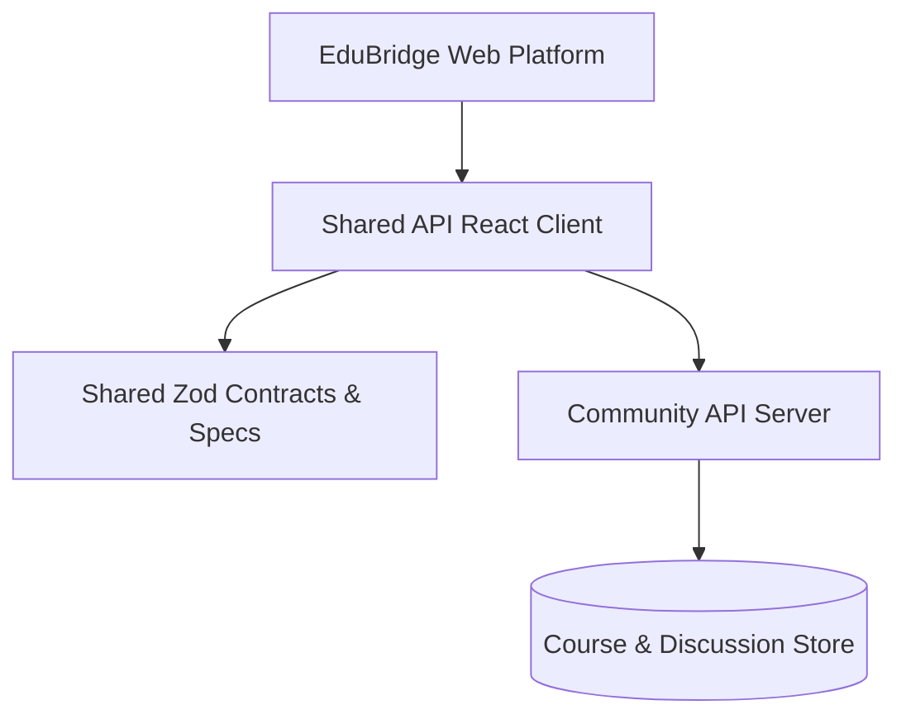

# Community Hub & EduBridge: Educational Platform Monorepo

Collaborative educational portal and learning community monorepo powered by pnpm workspaces, shared schema validation, and dedicated course discussion services.



## Architecture & Workspaces

Community Hub is engineered around the EduBridge education ecosystem, supporting interactive learning spaces, course discussions, and collaborative community boards.

### Monorepo Packages

- **`artifacts/edubridge/`**: Academic learning platform featuring student dashboards, course catalog browsing, and assignment discussion channels.
- **`artifacts/api-server/`**: Scalable Node.js API server coordinating student interactions, thread replies, and notification events.
- **`lib/api-zod/`**: Perimeter request validation schemas preventing malformed community posts or missing fields.
- **`lib/api-client-react/`**: Reusable data-fetching hooks providing optimistic UI updates for real-time discussions.
- **`lib/db/`**: Schema migrations and query builders for community models.

## Technology Stack

- **Package Manager**: pnpm workspaces
- **Frontend**: React 18, Vite, Tailwind CSS, TypeScript
- **Backend**: Node.js, Express, TypeScript, Zod
- **Build Tooling**: Turborepo / pnpm filter orchestration

## Local Development

```bash
# Install all monorepo dependencies
pnpm install

# Run the EduBridge client and API server concurrently
pnpm run dev
```
